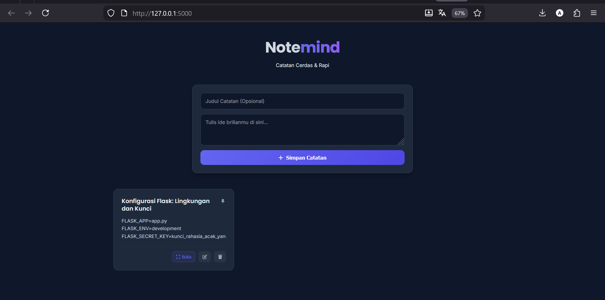

# NOTEDMIND 🧠



**Notemind** adalah aplikasi pencatat cerdas (*Smart Note-taking App*) berbasis web yang mengintegrasikan **Google Gemini AI**. Aplikasi ini dirancang untuk meningkatkan produktivitas dengan fitur otomatisasi seperti peringkasan catatan, pengembangan ide, hingga pembuatan judul otomatis, semuanya dalam antarmuka *Dark Mode* yang bersih dan modern.

## ✨ Fitur Unggulan

### 📝 Manajemen Catatan (Smart CRUD)
* [cite_start]**Create, Read, Update, Delete:** Pengelolaan catatan yang responsif tanpa *reload* halaman[cite: 1].
* [cite_start]**Pinning System:** Fitur untuk menyematkan (*Pin*) catatan penting agar selalu tampil di urutan teratas daftar[cite: 1].
* [cite_start]**Auto-Title AI:** Jika catatan disimpan tanpa judul, AI akan secara otomatis menganalisis konten dan membuatkan judul yang relevan[cite: 1].

### 🤖 Integrasi AI (Google Gemini 2.5 Flash)
[cite_start]Aplikasi ini menggunakan model `gemini-2.5-flash` untuk memberikan analisis mendalam pada catatan Anda[cite: 1]:
* **Ringkas (Summarize):** Membuat poin-poin ringkasan dari teks yang panjang.
* **ELI5 (Explain Like I'm 5):** Menjelaskan konsep kompleks dalam catatan dengan bahasa yang sangat sederhana.
* **Kembangkan (Expand):** Mengubah ide satu kalimat menjadi paragraf profesional.
* **Action Items:** Mengonversi narasi catatan menjadi daftar tugas (*To-Do List*) konkret.

### 🎨 Antarmuka Modern (UI/UX)
* [cite_start]**Clean Dark Mode:** Desain visual berbasis warna gelap (`#0f172a`) yang nyaman di mata[cite: 1].
* [cite_start]**Responsive Grid:** Tampilan kartu catatan yang menyesuaikan secara otomatis dengan ukuran layar perangkat[cite: 1].
* [cite_start]**Interactive Modals:** Edit dan lihat detail catatan menggunakan jendela *pop-up* untuk pengalaman pengguna yang cepat[cite: 1].

---

## 🛠️ Teknologi yang Digunakan

* **Backend:** Python 3, Flask
* [cite_start]**Database:** SQLite (menggunakan SQLAlchemy ORM) [cite: 1]
* [cite_start]**AI Engine:** Google GenAI SDK (`google-genai`) [cite: 1]
* [cite_start]**Frontend:** HTML5, CSS3 (Custom Properties), Vanilla JavaScript [cite: 1]
* [cite_start]**Environment:** `python-dotenv` untuk manajemen variabel lingkungan [cite: 1]

---

## 🚀 Panduan Instalasi & Menjalankan

Ikuti langkah-langkah lengkap berikut untuk menjalankan proyek ini di komputer lokal (Windows/Mac/Linux).

### Langkah 1: Clone Repository
Unduh kode sumber proyek ini ke komputer Anda.
```bash
git clone [https://github.com/sains855/NOTEDMIND.git](https://github.com/sains855/NOTEDMIND.git)
cd NOTEDMIND

```

### Langkah 2: Siapkan Virtual Environment (Disarankan)

Sangat disarankan menggunakan *virtual environment* agar library tidak konflik dengan sistem utama.

**Untuk Windows:**

```bash
python -m venv venv
venv\Scripts\activate

```

**Untuk Mac/Linux:**

```bash
python3 -m venv venv
source venv/bin/activate

```

### Langkah 3: Install Library Dependencies

Install semua paket Python yang dibutuhkan oleh aplikasi ini (Flask, SQLAlchemy, Google GenAI, dll).

```bash
pip install flask flask-sqlalchemy python-dotenv google-genai

```

### Langkah 4: Konfigurasi Environment Variables

Aplikasi ini membutuhkan API Key untuk berjalan.

1. Duplikat file `.env.example` dan ubah namanya menjadi `.env` (atau buat file baru bernama `.env`).
2. Isi file `.env` dengan konfigurasi berikut:


```ini
FLASK_APP=app.py
FLASK_ENV=development
FLASK_SECRET_KEY=masukkan_random_string_bebas_disini
GEMINI_API_KEY=masukkan_api_key_gemini_kamu_disini

```

> **Penting:** Anda bisa mendapatkan **GEMINI_API_KEY** secara gratis di [Google AI Studio](https://aistudio.google.com/).

### Langkah 5: Jalankan Aplikasi

Setelah konfigurasi selesai, jalankan server Flask dengan perintah:

```bash
python app.py

```

Jika berhasil, terminal akan menampilkan pesan: `Running on http://127.0.0.1:5000`.
Buka browser dan akses alamat tersebut.

---

## 📂 Struktur Folder

Berikut adalah struktur file dalam proyek ini:

```
NOTEDMIND/
│
├── instance/           # Folder tempat database SQLite (notemind.db) tersimpan otomatis
├── templates/          # Folder file antarmuka pengguna
│   └── index.html      # File utama Frontend (HTML/CSS/JS)
│
├── .env                # File konfigurasi sensitif (API Key) - JANGAN DI-UPLOAD KE GITHUB
[cite_start]├── .env.example        # Contoh template konfigurasi environment [cite: 1]
[cite_start]├── .gitignore          # Daftar file yang diabaikan oleh Git [cite: 2]
[cite_start]├── app.py              # File utama Backend (Flask Routes & AI Logic) [cite: 1]
└── README.md           # Dokumentasi proyek ini

```

## ⚠️ Troubleshooting (Masalah Umum)

1. **Error "ModuleNotFoundError":**
* Pastikan Anda sudah menjalankan perintah `pip install` di dalam folder proyek.
* Pastikan *virtual environment* (`venv`) sudah aktif sebelum menjalankan aplikasi.


2. **Fitur AI Tidak Bekerja:**
* Periksa kembali apakah `GEMINI_API_KEY` di file `.env` sudah benar dan valid.
* Pastikan komputer terkoneksi ke internet.


3. **Database Error:**
* Jika terjadi konflik database, hapus file `notemind.db` di dalam folder `instance/`, lalu jalankan ulang aplikasi `python app.py` untuk membuat database baru yang bersih.


---

Created with ❤️ by **sains855(Abrar Wujedaan)**

```

```